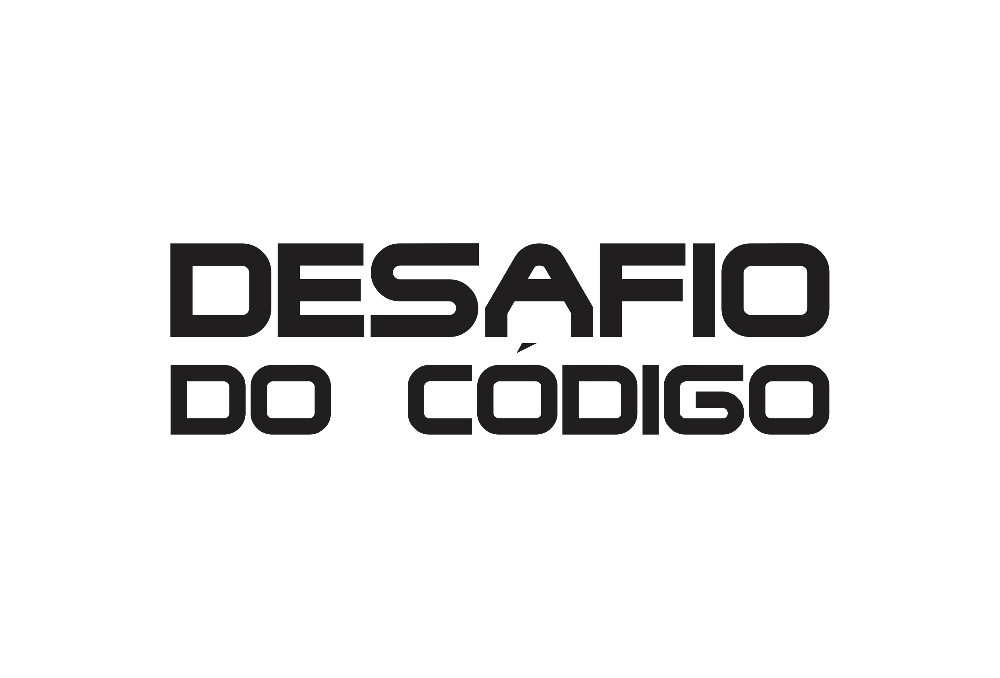
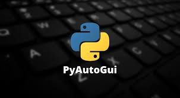

# Automacao-de-sistemas
Criando uma automação de sistemas
# Controle de Custos - Desafio

## Descrição do Desafio

Para controle de custos, todos os dias, seu chefe pede um relatório com todas as compras de mercadorias da empresa. O seu trabalho, como analista, é enviar um e-mail para ele, assim que começar a trabalhar, com as seguintes informações:

- Total gasto
- Quantidade de produtos compradas
- Preço médio dos produtos

## Instruções

1. Clone este repositório para o seu computador.
2. Instale as dependências necessárias executando `pip install -r requirements.txt`.
3. Execute o script `automacao.py` para gerar o relatório automaticamente.
4. Verifique o resultado gerado na pasta `relatorios`.

## E-mail do Chefe

E-mail do seu chefe: **chefe@empresa.com**
(Este é um exemplo fictício para o exercício)

## Acesso ao Sistema

Acesse o sistema da empresa através do link: [Sistema da Empresa](https://pages.hashtagtreinamentos.com/aula1-intensivao-sistema)

## Biblioteca de Automação - pyautogui

Este projeto utiliza a biblioteca `pyautogui` para automatizar comandos do mouse e do teclado. A automação facilita a geração do relatório diário de forma eficiente.

